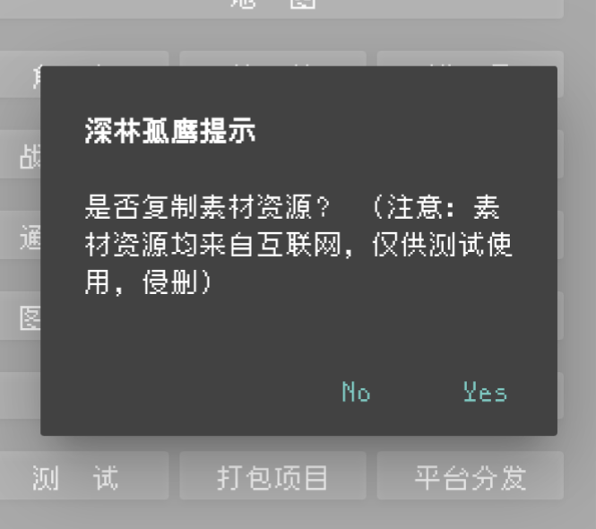
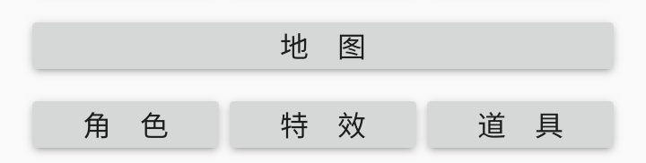
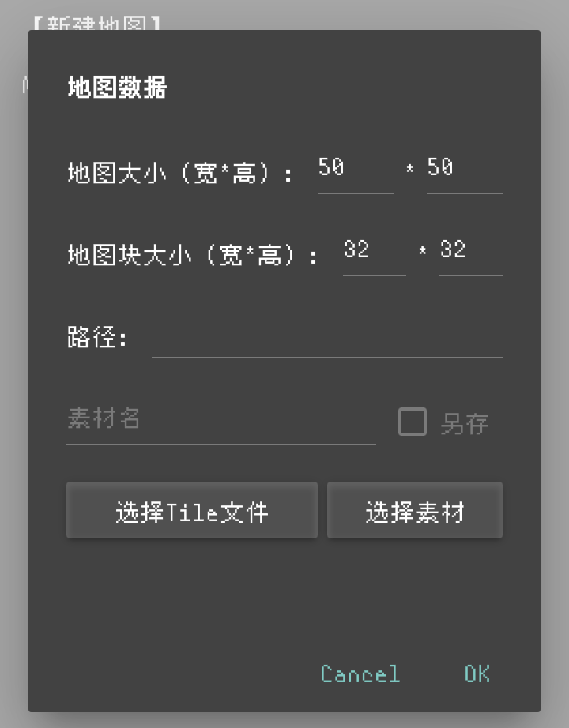
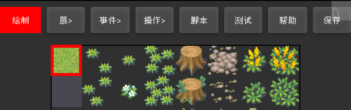
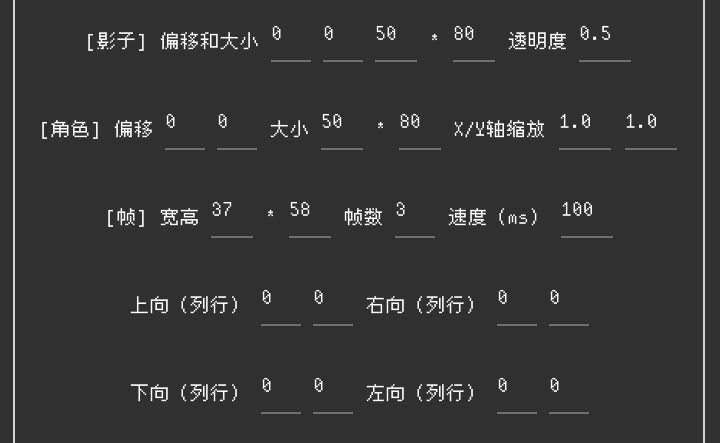

## 重要提示

如果你是安卓端，请下载`MT管理器`获得较好体验。

[点击下载](https://mt2.cn/)

在演示中，我们将以MT管理器为编写代码软件。

此外，在新建项目时，请务必选择复制资源，这是教程所需资源！

Tips：在未来的学习中，我们将学习如何导入素材(非自带素材)！

## JavaScript贴士

在编程中，语言是基础，在鹰歌框架中，使用`JavaScript`+`Qml`作为引擎语言。

实际使用过程中，为了代码规范，加入`;`作为结束标志，当然，你也可以不加。

此处应当与html中使用的javascript区分！

* 变量关键词`var`,`let`

变量，顾名思义，会改变的量，在编程中，我们希望改变一个对象(Object)的值，变量就要发挥作用，与之对应便是常量。

```javascript
var a = 123;
var b = "你好 世界";
var c = true;
```

我们把a当做数字123，把b当做字符串“你好 世界”，把c当做是否

这就是最基本三大类型：`字符串`，`整形`，`布尔值`

在javascript中，变量可以是任意类型

* 常量关键词`const`

用法与变量大差不差，但初次赋值后将不会再改变。

* if-else关键词

```javascript
var a = "你好 世界";
if(a = "Hello World"){
    console.info("变量a的值是Hello World");
}
else{
    console.info("变量a的值其实是"+a);
}
```

> 变量与常量几乎可以在任意地点引用

通过上述代码，你应该了解了if-else的基本用法

## 创建项目之地图编辑器

* 打开鹰歌，选择创建工程


* 选择yes


* 选择地图


我们来认识一下`地图`页面的控件

* 点击新建地图


可以看到许多选项

**地图大小**：指整张地图容纳多少地图块

**地图块大小**：引擎用来裁剪地图文件的一个规范
以32x32为例：将一张1000x1000的图片按32x32裁剪成一个地图块，在地图编辑中可以很好体现

**路径**：默认填充，无需更改

* 接下来我们点击选择素材


可以看到，有许多自带素材，我们演示选择草地。

接下来，我们设置地图大小为20x20，地图块大小为32x32，然后点击OK

这是编辑地图的一个演示，我们来看里面的控件



* **红色按钮(默认绘制)**

红色按钮包含：`绘制`，`特殊`，`事件`，`移动`

* `绘制`

绘制顾名思义，你可以选中图片的地图块，绘制到画布中

* `特殊`

给地图(画布)上的对象添加障碍对象，使得角色无法穿过

* `事件`

在红色按钮右侧可以看到 *事件* 按钮

它可以创建事件层，点击红色按钮到事件，在地图上可以绘制出事件！

事件点：当主角运动到该点会触发此事件。

* `移动`

当你发现地图较大，无法移动到需要的点位去绘制地图，将红色按钮定向为移动，可以使画布移动！

Tips：红色按钮可以多次点击，切换功能呦！

### 地图编辑器其他重要功能

* **层**

图层，高级图层的内容(画布上)覆盖低级图层，就和画画软件的图层一样！

* **脚本**

在地图编辑器内编写该地图下的脚本

* **测试**

测试该地图

* **保存**

保存该地图

## 创建项目之角色编辑器

主界面打开 *角色* ，点击新建角色

可能你看到这个界面就会晕头转向(这是啥？？？)

别急，我们分三部分说。

### 第一部分



如果你是下列这种(教程只说这种)行走图，选择典型行走图


* 移动速度

角色默认移动速度，期望在(0.05-0.1)

* 可穿透

为0不可穿透<br>为1可穿透

> 学完这个，其他功能请你自己探索奥！
> 你可以试着评论！
